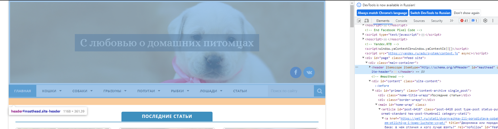

### Задача: на основе сайта https://pet7.ru/
 - **Определите, на каком протоколе работает сайт.**
 - **Проанализируйте структуру страницы сайта.**
 - **Внесите не менее 3 изменений на страницу с помощью инструмента разработчика и представьте скриншоты было/стало.**
 - **Создайте прототип низкой детализации.**

**1. Протокол на каком  работает сайт.**

**2. Структура страницы сайта.**
header

primary

footer

**3. Изменения на странице при помощи инструмента разработчика**

**4. Протатип низкой детализации сайта**
